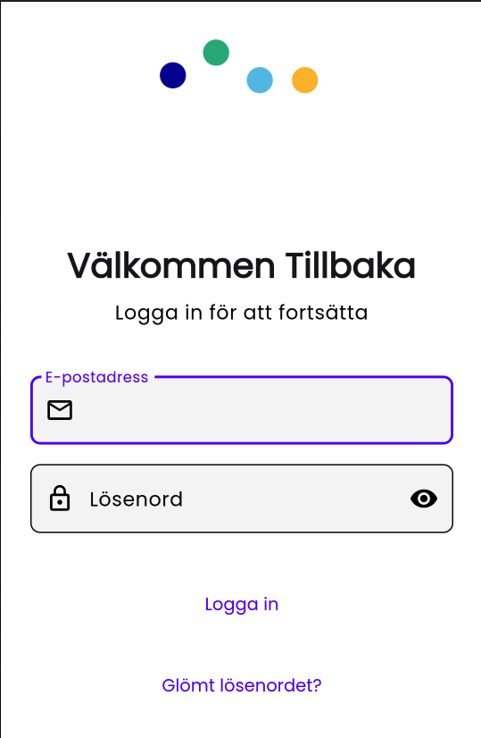
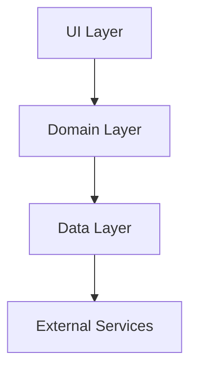

<div align="center">

# 🌟 GoatrikHub

[](https://flutter.dev)
[](LICENSE)
[](CONTRIBUTING.md)

[](https://codecov.io/gh/yourusername/goatrik_hub)

<p align="center">
  
</p>

### 🚀 Ett modernt och skalbart Flutter-projekt med fokus på användarupplevelse och säkerhet

[Funktioner](#-funktioner) •
[Kom igång](#-kom-igång) •
[Arkitektur](#-arkitektur) •
[Bidra](#-bidra) •
[Dokumentation](#-dokumentation)

---

<p align="center">
  
  &nbsp;&nbsp;&nbsp;&nbsp;

</p>

</div>

## ✨ Funktioner

### 🔐 Avancerad Autentisering & Behörighet
- Multi-nivå rollsystem (User, Admin, SuperAdmin)
- JWT-baserad autentisering
- Säker sessionshantering
- OAuth 2.0 integration

### 🎨 Modern UI/UX
- Material Design 3 med dynamiska färgteman
- Mörkt/ljust läge
- Responsiv design för alla skärmstorlekar
- Anpassningsbara widgets

### 🏗 Robust Arkitektur
- Clean Architecture principer
- Provider för state management
- Dependency Injection
- Modulariserad kodstruktur

### 🔄 Backend Integration
- RESTful API integration
- Effektiv felhantering
- Automatisk token refresh
- Offline-stöd

### 📊 Admin Dashboard
- Användarhantering
- Rollhantering
- Systemövervakning
- Analytics och rapporter

## 🚀 Kom igång

### Förutsättningar

- Flutter SDK (>=3.24.0)
- Dart SDK (>=3.0.0)
- Android Studio / VS Code
- Git

### Installation

1. Klona repot
```bash
git clone https://github.com/GoatrikWorks/goatrik_hub.git
```

2. Installera beroenden
```bash
cd goatrik_hub
flutter pub get
```

3. Konfigurera miljövariabler
```bash
cp .env.example .env.development
```

4. Kör appen
```bash
flutter run
```

<details>
<summary><b>📱 Plattformsspecifika inställningar</b></summary>

## Android
### Lägg till följande i android/app/build.gradle:
```gradle
android {
    defaultConfig {
        minSdkVersion 21
        targetSdkVersion 34
    }
}
```

## iOS
### Uppdatera ios/Runner/Info.plist
```xml
<key>NSCameraUsageDescription</key>
<string>This app needs camera access for profile photos</string>
```
</details>

## 🏗 Arkitektur
```
lib/
├── core/
│   ├── config/
│   ├── network/
│   ├── theme/
│   └── utils/
├── features/
│   ├── auth/
│   ├── home/
│   └── admin/
└── main.dart
```

## Arkitekturella Principer
<details>
<summary>Clean Architecture</summary>



</details>
<details>
<summary>State Management</summary>
Provider för enkel state management, Freezed för immutable models, och Repository pattern för datahämtning.
</details>

## 🔧 Konfiguration
### Miljövariabler
```env
API_URL=http://localhost:3000
CONNECT_TIMEOUT=5000
RECEIVE_TIMEOUT=3000
```

---

Supported Platforms  
| Platform | Status       |
|----------|--------------|
| Android  | ✅ Supported |
| iOS      | ✅ Supported |
| Web      | 🚧 In progress |
| Windows  | 🚧 In progress |
| macOS    | 🚧 In progress |
| Linux    | 🚧 In progress |
